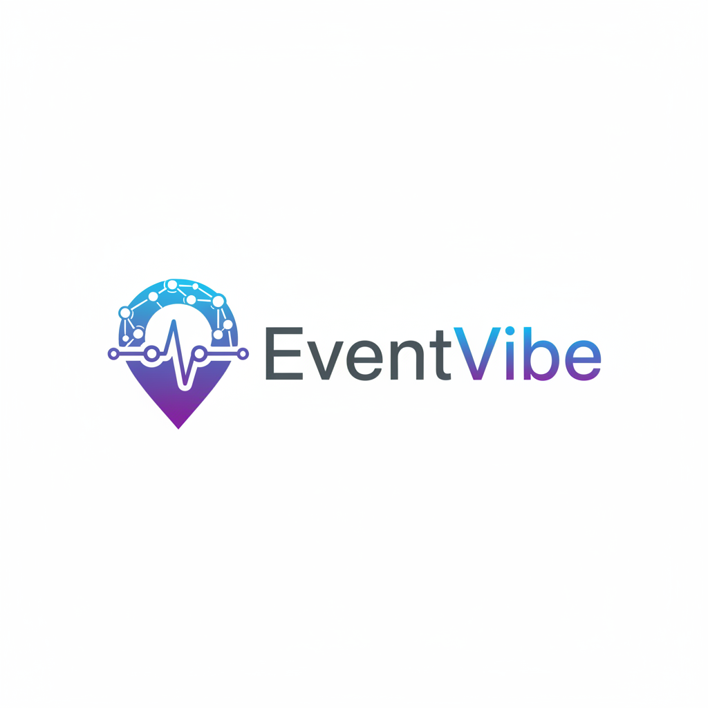

  

# Event Vibe

---
## Problem Statement

🧩 Problem Statement (PS-12: Social Common-Ground Finder)

In today’s socially diverse environment, groups often struggle to identify events or activities that satisfy conflicting individual interests and varying geographic locations. While each member may have distinct hobbies, preferences, and travel constraints, existing platforms primarily cater to individual users, failing to address the complexity of group-based decision making.

## Solution Overview

EventVibe is a web-based Social Common-Ground Finder designed to help groups discover optimal events by analyzing shared interests and geographic constraints. The platform focuses on group-centric decision making rather than individual recommendations.

The system enables participants to explore events using structured filters such as interests, location, date, and group size, allowing groups to identify activities that maximize common hobbies while minimizing travel effort. In parallel, organizers are provided with a dedicated interface to create and manage events, ensuring relevant and well-categorized event listings.

## Description

EventVibe is a role-based web platform that helps groups find optimal events by analyzing shared interests and locations. It enables participants to discover suitable events while allowing organizers to create and manage event listings efficiently.

---

## Table of Contents

- [Features](#features)
- [Demo / Screenshots](#demo--screenshots)
- [Technologies Used](#technologies-used)
- [Project Structure](#project-structure)
- [Contributors](#contributors)
- [Contact / Support](#contact--support)
- [Acknowledgements](#acknowledgements)

---

## Features

- **Role-Based Authentication**
  - Separate access for Participants and Organizers
  - Secure login using Firebase Authentication

- **Group-Centric Event Discovery**
  - Event recommendations based on shared interests
  - Designed for groups rather than individual users

- **Advanced Event Filtering**
  - Filter events by:
    - Interests
    - Location
    - Date
    - Group size

- **Participant Dashboard**
  - Explore available events
  - View event details in a structured layout

- **Organizer Dashboard**
  - Create new events
  - Manage and publish event information

- **Responsive & User-Friendly UI**
  - Clean, intuitive design
  - Works across different screen sizes

- **Scalable Backend**
  - Firebase Firestore for real-time data storage
  - Easily extendable for future features

---

## Demo / Screenshots

- **Live MVP :** [https://9000-firebase-studio-1767276819254.cluster-fdkw7vjj7bgguspe3fbbc25tra.cloudworkstations.dev]
  
- **Demo Video :** [Add Demo Video Link Here]
  
- **Github Repository Link:** [Add Demo Video Link Here]
  
- **Presentation / PPT:** [Add PPT Link Here]
  

- **Screenshot / GIF Placeholder:**  .png)

---

##  Technologies Used

- **Frontend**
  - HTML5
  - CSS3
  - JavaScript

- **Backend & Services**
  - Firebase Authentication
  - Firebase Firestore (Database)

- **Hosting & Deployment**
  - Firebase Hosting

- **Development Tools**
  - Git & GitHub
  - Browser-based testing tools

- **Design & Documentation**
  - PowerPoint (for project presentation)
  - README documentation

---
## 📂 Project Structure

The repository is organized to maintain clarity, scalability, and ease of development.

- `public/`  
  Contains all client-side files served to users.

- `public/index.html`  
  Main entry point of the application.

- `public/css/`  
  Contains all styling files for layout and UI design.

- `public/js/`  
  Contains JavaScript files handling application logic, authentication, and interactions.

- `public/assets/`  
  Stores images, icons, and static resources.

- `firebase.json`  
  Firebase hosting and deployment configuration.

- `.gitignore`  
  Specifies files and folders to be excluded from version control.

- `README.md`  
  Project documentation.

---
## Contributors

- **Samhith V Gupta**
- **Madhan BV**
- **Avyum chhetri**
  

---
##  Usage

This section explains how users interact with the platform after deployment.

### Participant Flow
1. Open the application in a web browser.
2. Click on **Login** and select **Participant** as the user role.
3. Browse available events using filters such as interests, location, date, and group size.
4. View event details and choose events that best match group preferences.

### Organizer Flow
1. Open the application and log in as an **Organizer**.
2. Access the organizer dashboard.
3. Add new events by providing event details such as title, interests, location, date, and group size.
4. Manage and publish events for participants to explore.

---
## 🔮 Future Scope

- Intelligent event recommendations using interest-matching algorithms  
- Real-time notifications and reminders for events  
- In-app event registration and attendance tracking  
- Advanced analytics dashboard for organizers  
- Mobile application support for wider accessibility  

---
## Contact / Support

- **Madhan B V** – [GitHub](https://github.com/MadhanBV) – Email: madhanbv.cse@gmail.com
- **Samhith V Gupta** – [GitHub](https://github.com/SVG700) – Email: samhithvgupta@gmail.com
- **Avyum Chettri** - [GitHub](https://github.com/AlvinChhetri/AlvinChhetri) - Email: alvinch431@gmail.com

##  Acknowledgement

We would like to express our sincere gratitude to the **CRACK-A-THON (PU) organizers** for providing the platform and opportunity to work on real-world problem statements. We also thank our  peers for their guidance, feedback, and continuous support throughout the development of this project.

---

## Thank You

Thank you for reviewing our project. We appreciate your time and feedback.  
We hope **Event Vibe** contributes positively to building understanding and collaboration among users.

